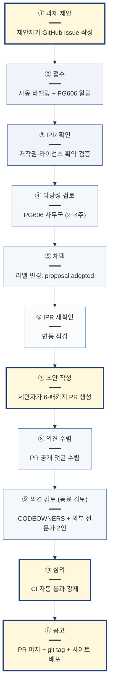

# 표준 제안 라이프사이클

본 페이지는 **새로운 메타데이터 표준안이 제안되어 정식 발행되기까지의 라이프사이클**을 설명합니다.

본 라이프사이클은 TTA 표준 제·개정의 **공식 11단계 프로세스**를 GitHub 메커니즘으로 자동화한 것이며, [표준화 지침 개정안 (B-10)](framework/index.md#13-본-정의서와-다른-산출물의-관계)의 핵심 구현부입니다.

!!! tip "신규 표준을 제안하시려면"
    바로 [신규 AI 레디 표준 제안 Issue](https://github.com/ai-ready-standards/tta-ai-ready/issues/new?template=proposal-new-standard.md)에서 시작하실 수 있습니다.

---

## 11단계 한눈에 보기



진한 노란색 4단계가 **본 사업이 기존 11단계에 자동 검증·동료 검토·리포지토리 등록을 의무화한 핵심 개정 포인트** ([수행계획서 B-4](https://github.com/ai-ready-standards/tta-ai-ready/blob/main/standards/) 참조).

---

## 단계별 GitHub 구현

### ① 과제 제안

| 항목 | 내용 |
| --- | --- |
| 누가 | 제안자 (TC 담당자 또는 외부 전문가) |
| 어디서 | GitHub Issue |
| 무엇을 | [신규 표준 제안 양식](https://github.com/ai-ready-standards/tta-ai-ready/issues/new?template=proposal-new-standard.md) 작성 |
| 자동/수동 | 수동 |

### ② 접수

| 항목 | 내용 |
| --- | --- |
| 누가 | 시스템 자동 |
| 무엇을 | `proposal:received` + `needs-feasibility-review` 라벨 자동 부여, PG606 사무국 자동 알림 |
| 자동/수동 | **자동** |

### ③ IPR 확인

| 항목 | 내용 |
| --- | --- |
| 누가 | PG606 사무국 |
| 무엇을 | Issue 양식 6번 IPR 확약 항목 4개 모두 체크 확인. 첨부 IPR 확약서 검증 |
| 자동/수동 | 반자동 (체크박스 자동 검증 + 첨부 수동 검토) |

### ④ 타당성 검토

| 항목 | 내용 |
| --- | --- |
| 누가 | PG606 사무국 + (필요 시) 도메인 전문가 |
| 무엇을 | 다음 항목 검토:<br/>• 도메인 적합성<br/>• 기존 표준과의 중복·충돌<br/>• 기관 신뢰성<br/>• 7-구성요소 사전 분석의 타당성<br/>• 일정 현실성 |
| 결과 | 라벨 `feasibility:approved` 또는 `feasibility:rejected` |
| 소요 시간 | 2~4주 |
| 자동/수동 | 수동 (PG606 결정) |

### ⑤ 채택

| 항목 | 내용 |
| --- | --- |
| 누가 | PG606 |
| 무엇을 | 라벨 `proposal:adopted` 부여, GitHub Project 보드의 "채택됨" 컬럼으로 이동 |
| 결과 | 제안자가 ⑦ 초안 작성으로 진행 가능 |
| 자동/수동 | 수동 |

### ⑥ IPR 재확인

| 항목 | 내용 |
| --- | --- |
| 무엇을 | 채택 후 ~ 초안 작성 시작 사이 변경된 권리 관계 재확인 |
| 자동/수동 | 수동 |

### ⑦ 초안 작성

| 항목 | 내용 |
| --- | --- |
| 누가 | 제안자 |
| 어디서 | GitHub PR (`feat/p-XX-domain` 브랜치) |
| 무엇을 | **6-패키지 구조** 작성:<br/>1. `1_document/<id>-AP.md`<br/>2. `2_schema/context.jsonld + shapes.shacl.ttl`<br/>3. `3_code/` Python Pydantic + 단위 테스트<br/>4. `4_validator/`<br/>5. `5_examples/` 실제 시나리오 3종 이상<br/>6. `6_changelog/CHANGELOG.md` |
| 가이드 | [TC 개발 가이드](manuals/tc-developer-guide.md) + [기존 표준 전환 매뉴얼](manuals/migration-guide.md) |
| 자동/수동 | 수동 (작성) |

### ⑧ 의견 수렴

| 항목 | 내용 |
| --- | --- |
| 어디서 | PR Conversation (공개) |
| 누가 | 누구나 (GitHub 계정 보유자) |
| 무엇을 | PR 코멘트로 의견 제시 |
| 기간 | 최소 2주 (개정안에서 의무화) |
| 자동/수동 | **자동** (PR 공개 자체로 수렴) |

### ⑨ 의견 검토 (동료 검토 — 신설)

| 항목 | 내용 |
| --- | --- |
| 누가 | CODEOWNERS 자동 지정 + **외부 전문가 2인** |
| 무엇을 | 서면 검토 의견서 작성, 쟁점 사안은 검토 회의 |
| 통과 기준 | CODEOWNERS Approval + 외부 전문가 검토 의견 90% 이상 반영 |
| 자동/수동 | 반자동 (자동 reviewer 지정 + 수동 검토) |

### ⑩ 심의 (자동 검증 통과 의무 — 신설)

| 항목 | 내용 |
| --- | --- |
| 누가 | GitHub Actions CI |
| 무엇을 | 다음 4가지 모두 통과해야 머지 가능:<br/>• `tta-verify-mappings` 100% 통과<br/>• `pytest` 단위 테스트 모두 통과 + 커버리지 80%+<br/>• 모든 `5_examples/*.jsonld`이 SHACL conform<br/>• Ruff 린트 경고 0건 |
| 결과 | 빨간 ❌ 또는 ✅ |
| 자동/수동 | **완전 자동** |

→ ⑩ 단계는 **사람의 결정 없이 100% 자동**입니다. 기준 미달 시 PR 머지 차단.

### ⑪ 공고 (리포지토리 등록 의무화 — 신설)

| 항목 | 내용 |
| --- | --- |
| 누가 | PM (단일 머지 권한) |
| 무엇을 | PR 머지 → main 반영 |
| 자동 후속 | • main push 시 GitHub Pages 자동 재배포<br/>• `git tag` 자동 (예: `P-06/v1.0.0`)<br/>• catalog.jsonld 자동 갱신<br/>• re3data 등록 (해당 시) |
| 자동/수동 | 머지 수동 + 후속 자동 |

---

## 자동화 vs 사람 결정의 분리

본 라이프사이클의 핵심 가치는 **무엇은 기계가 강제하고 무엇은 사람이 결정하는지의 명확화**입니다.

### 기계가 자동으로 강제하는 것 (객관적 통과 기준)

- ✅ JSON-LD 문법 0건 오류
- ✅ SHACL 적합성 (모든 examples conform)
- ✅ 매핑 어휘 100% 정합 (정식 어휘에 정의됨)
- ✅ 단위 테스트 80%+ 커버리지
- ✅ 6-패키지 구조 완전성

→ 이 자동 기준 미달이면 **PG606·SPC가 심의조차 못함**.

### 사람이 결정하는 것 (가치 판단)

- ⚖️ 도메인 적합성 (PG606)
- ⚖️ 본문 vs 부록 충돌 해결 (TC 의장)
- ⚖️ 매핑 신뢰도 평가 (외부 전문가)
- ⚖️ 채택·반려 (PG606 + SPC)

→ 사람의 판단은 **가치 결정에만 집중**.

---

## 일정 추정 (제안자 관점)

| 단계 | 소요 시간 |
| --- | --- |
| ① 과제 제안 | 1일 |
| ② 접수 ~ ③ IPR 확인 | 1주 |
| ④ 타당성 검토 ~ ⑤ 채택 | 2~4주 |
| ⑥ IPR 재확인 | 수일 |
| ⑦ 초안 작성 | **표준 종류에 따라 6~16주** ([기존 표준 전환 매뉴얼 → 일정 추정](manuals/migration-guide.md#부록--전환-작업-일정-추정)) |
| ⑧ 의견 수렴 | 2~4주 |
| ⑨ 의견 검토 | 2주 |
| ⑩ 심의 | 분 ~ 시간 (자동) |
| ⑪ 공고 | 즉시 |
| **총 합** | **약 4~6개월** |

→ 기존 TTA 11단계 평균 6~12개월 대비 **30~50% 단축 가능**.

---

## 시범 운영 (사업 진행 중)

본 사업의 5종 시범 표준은 본 라이프사이클의 **reference implementation**입니다.

| 표준 | 라이프사이클 적용 시점 |
| --- | --- |
| P-01 (TTAK.KO-10.0976) | 적용 완료 (AP 1.0.0 발행됨) |
| P-02 ~ P-05 | 2026-08~11 진행 |
| 사업 종료 후 | TTA의 모든 신규 메타데이터 표준에 적용 |

---

## 본 사업 산출물과의 연결

본 라이프사이클은 본 사업의 모든 산출물을 하나로 연결합니다.

| 산출물 | 라이프사이클 역할 |
| --- | --- |
| [프레임워크 정의서 (B-3)](framework/index.md) | ⑦ 초안이 따라야 할 규범 |
| 표준화 지침 개정안 (B-10) | 본 라이프사이클의 제도적 정의 |
| [TC 개발 가이드 (D-2)](manuals/tc-developer-guide.md) | ⑦ 초안 작성자 가이드 |
| [전환 매뉴얼 (D-3)](manuals/migration-guide.md) | ⑦ 단계별 실행 가이드 |
| 검증 도구 (tta-validator) | ⑩ 자동 심의 도구 |
| 5종 파일럿 패키지 | ⑦의 reference implementation |

---

## 향후 확장 (사업 종료 후)

본 라이프사이클은 메타데이터 표준에서 출발하지만, 다음으로 확장 가능합니다:

```
Phase 1 (본 사업, ~2026-12)
└── 메타데이터 스키마 표준 라이프사이클

Phase 2 (2027~)
└── 원시 데이터 표준 라이프사이클 (시계열, 영상, 센서 등)

Phase 3 (장기)
└── 인터페이스 표준 (API, gRPC), 품질 표준 등으로 확장
```

→ TTA 전체 PG의 표준화 절차에 적용 가능한 **일반 메커니즘**.

---

## 참고 링크

- [신규 표준 제안 시작 :material-rocket:](https://github.com/ai-ready-standards/tta-ai-ready/issues/new?template=proposal-new-standard.md){ .md-button .md-button--primary }
- [기존 제안 일람](https://github.com/ai-ready-standards/tta-ai-ready/issues?q=label%3Aproposal%3Areceived){ .md-button }
- [채택된 제안 일람](https://github.com/ai-ready-standards/tta-ai-ready/issues?q=label%3Aproposal%3Aadopted){ .md-button }
